# 环境配置指南

如序言所述，我们建议读者使用 Thonny 完成实验，因此其使用方式会放在最开始进行介绍. 另外，我们会介绍命令行工具的使用方法，但这是较为不推荐的方式，因为它要求读者对计算机有基本的了解，有一定自行解决遇上的困难的能力.

## Thonny 的安装和使用

### 下载并安装 Thonny

打开 [Thonny 官网](https://thonny.org)，将鼠标移动到下图右上角的 "Windows" 上，选择第一个链接进行下载. 不建议使用 Python 3.8 的版本，事实上 Python 3.10 也并非最新，但对于本课程来说已经足够使用了.

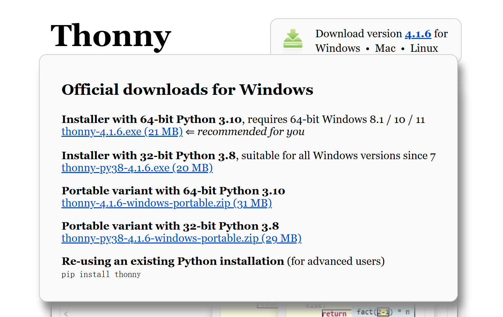

然后运行安装程序，按照指引完成安装. 等到出现如下界面，就表明安装已经完成：

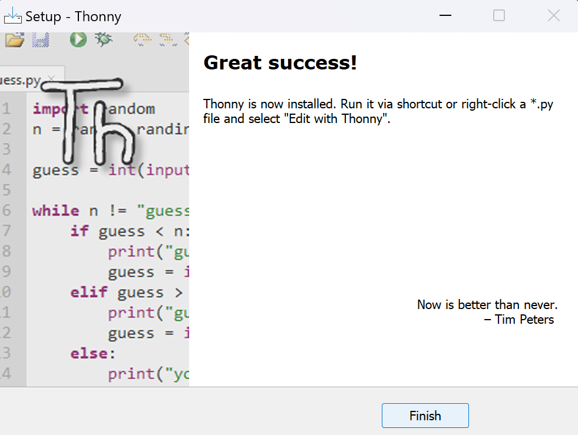

### Thonny 界面介绍和使用

点击 Thonny，选择简体中文，打开后其界面应当如下图所示：

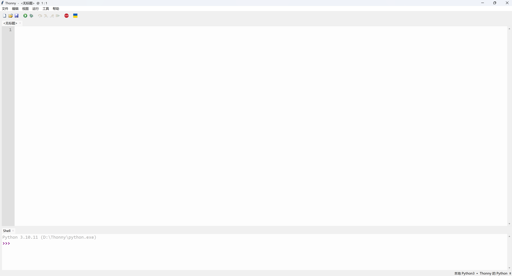

可以看见，其界面的编辑区域分上下两块，其中上面是正常的编辑器，下面是交互式终端. 首先，可以在交互式终端输入命令进行测试：

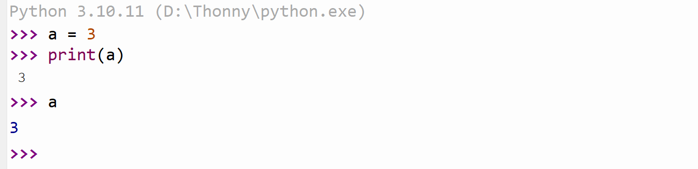

可以看见，输出的两个 3 是有所不同的，这是因为 `print` 函数是正常的输出函数，而直接输入 `a` 输出 3 是在交互式终端中的特别结果. 应当注意，在正常的程序编写当中，只有 `print` 这样的函数会真正产生输出. 接下来在编辑器中尝试输入以下代码：

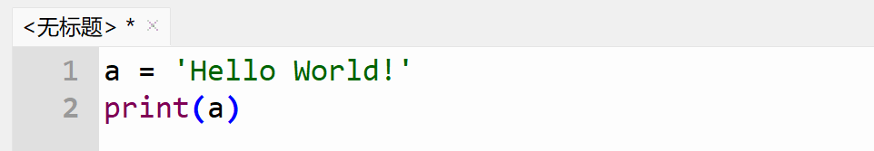

在菜单栏的运行菜单中选择“运行”，如下图所示：

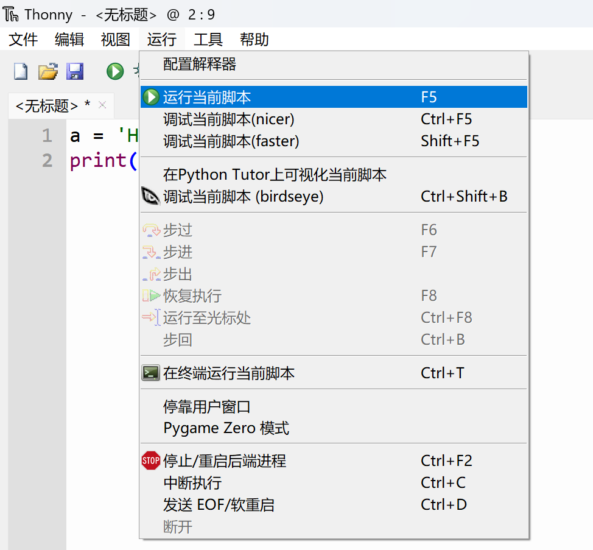

或者你也可以直接点击 F5 进行运行. 注意到，在上图高亮的行末有一个 F5，这是 Thonny 中对快捷键的提示. 你会发现，在交互式终端的窗口中，出现了下面的输出：

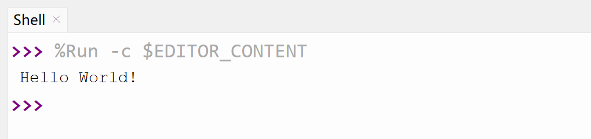

这就表明程序正常运行并输出了结果.

### 使用 Thonny 进行包管理

点击菜单栏中的工具并选择“管理包…”，如下图：

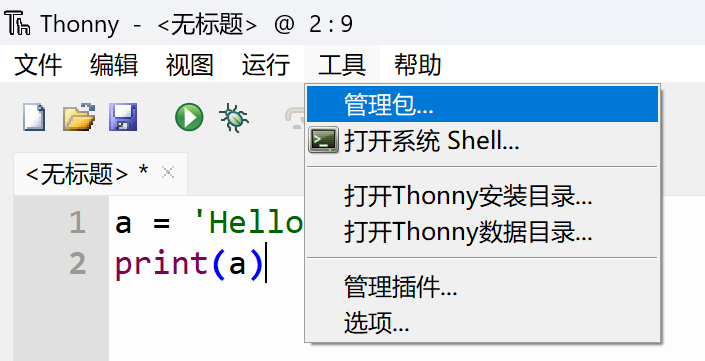

这将打开下图的窗口：

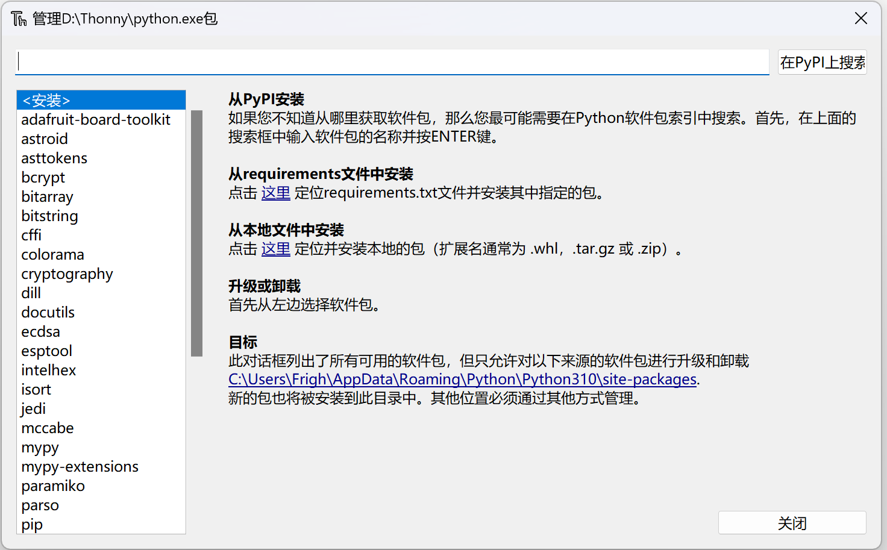

在上面的搜索栏中输入包名，并且点击搜索，打开对应的蓝色链接，这里以 NumPy 为例，你将看到下面的界面：

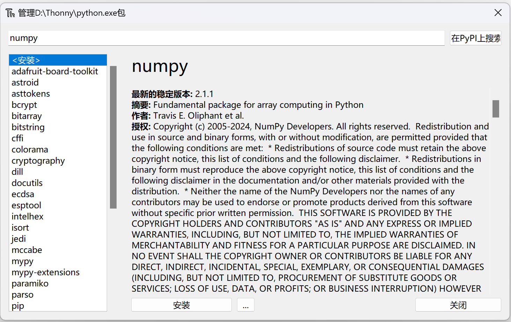

点击安装并等待安装完成. 安装完成后，安装按钮会变成“升级”和“卸载”，关闭窗口. 可以在交互式终端中使用 `import` 命令导入包以测试其安装是否完成：

```python
>>> import numpy
```

如果没有红色报错信息，则说明安装正常.

## 使用命令行工具进行包管理

!!! warning
    
    这里的许多配置都并非最佳选项. 在本机上直接安装 Python 及其软件包更为推荐的一种方式是建立虚拟环境，使用例如 conda 之类的工具进行管理，否则可能会出现尾大不掉、甚至版本冲突的问题. 但是在此为了简单起见，我们直接使用本机的基础环境建立 Python 安装，这对于我们的这些实验本身来说足够了. 有兴趣的同学自可查找关于 conda 的相关信息，我们以后也可能会在补充文档中进行介绍.

    另外，因为这是较为不推荐的方式，这里的文档会有所精简，且仅对 Windows 系统用户进行介绍. 如果使用 macOS，Python3 通常是自带的，读者可直接跳到命令行的使用部分，用自带的终端执行对应的指令完成操作.

### Python 的下载和安装

打开 [Python 官网](https://www.python.org/)，点击图示按钮下载 Python 的安装包：

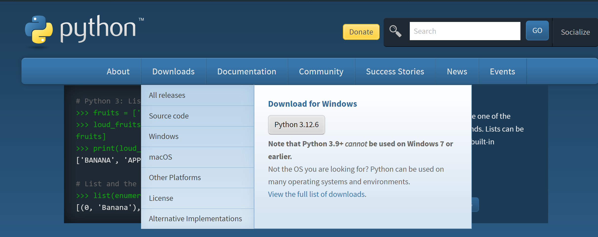

运行安装包进行安装. 在安装过程中，勾选选项 "add to environment variable". 如果没有勾选，会出现在 Powershell 中无法识别指令的问题，请参见“环境变量相关事宜”一节进行解决.

### 命令行的使用

按 Windows + R 打开运行界面，输入 powershell 并回车. 你应当会看到一片蓝色的界面：


其中 `Frigh` 应该是你的用户名. 在其中输入 `python`，并回车. 为美观起见，下面笔者的界面都是安装了 Windows Terminal 之后的执行结果，默认终端输入输出无殊.

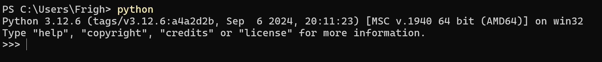

你会发现我们同样进入了交互式终端的界面. 在其中你同样可以进行交互式终端的操作. 输入 `exit()` 或者 Ctrl + Z 以退出.

### 使用 pip 进行包管理

在终端中输入下面的指令并按下回车：

```powershell
python -m pip install <包名>
```

其中 `<包名>` 需要替换成你需要安装的包. 我们依旧以 NumPy 为例：

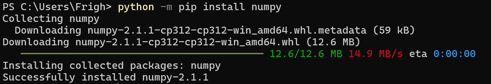

于是 NumPy 就已经安装成功. 同样可以打开交互式终端以验证其安装.

!!! note

    这里我们使用的是
    
    ```powershell
    python -m pip install <包名>
    ```
    而不是一般的教程使用的更精简的
    ```powershell
    pip install <包名>
    ```
    这是因为直接使用 `pip` 指令进行安装的方式在较新的版本中将被弃置.

    此外，如果 `python` 指令不起作用，可以尝试直接使用 `py` 或者 `python3`，如果依旧不行，请参阅环境变量相关事宜一节.

### 环境变量相关事宜

通俗地讲，环境变量（environment variable / PATH）就是系统在收到一个指令之后应该到哪里去寻找这个指令. 打开 Python 的安装目录，我们会看到一堆 exe 类型的文件：

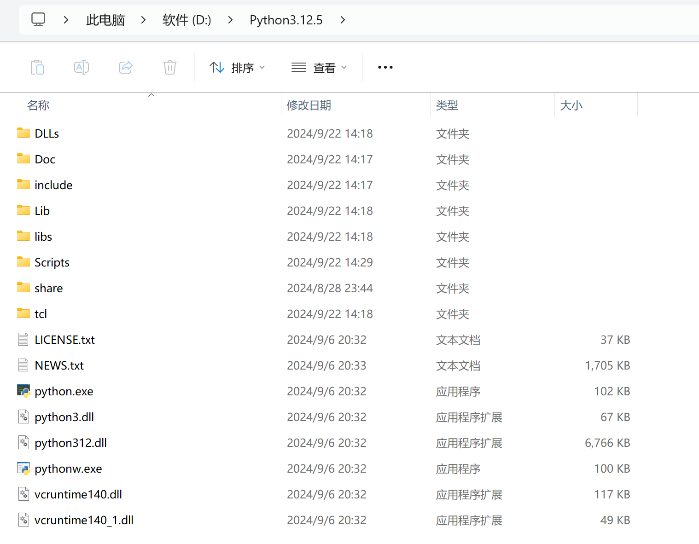

复制这个路径以备使用. 在设置中搜索“环境变量”，打开“修改本账户的环境变量”，你会看到以下窗口：

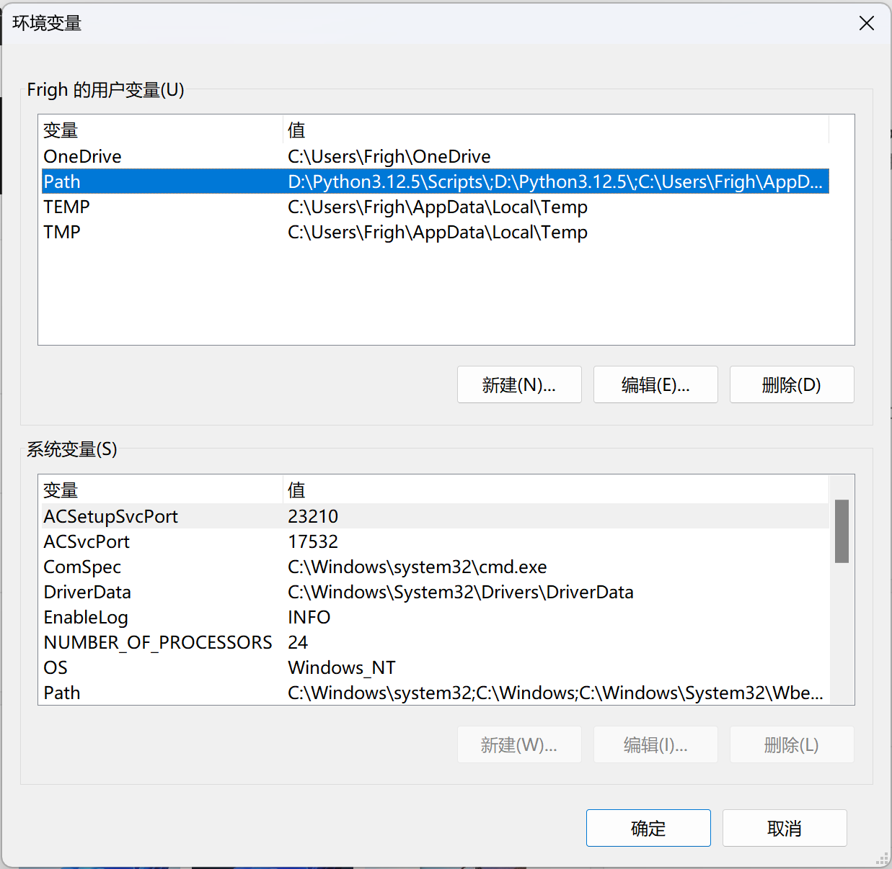

然后选择 Path 变量，点击编辑，将这个目录和 `Scripts` 目录都加在最前面. 因为笔者使用的安装目录为 `D:\Python3.12.5`，修改完的 Path 就如上图所示. 修改完后，重启电脑，重新进行操作，你应当能够正常在命令行中执行 `python` 指令.

## 参考资料

- [Thonny 官网](https://thonny.org)
- [Python 官网](https://www.python.org)
- [pip 官方文档](https://pip.pypa.io/en/stable/user_guide/)