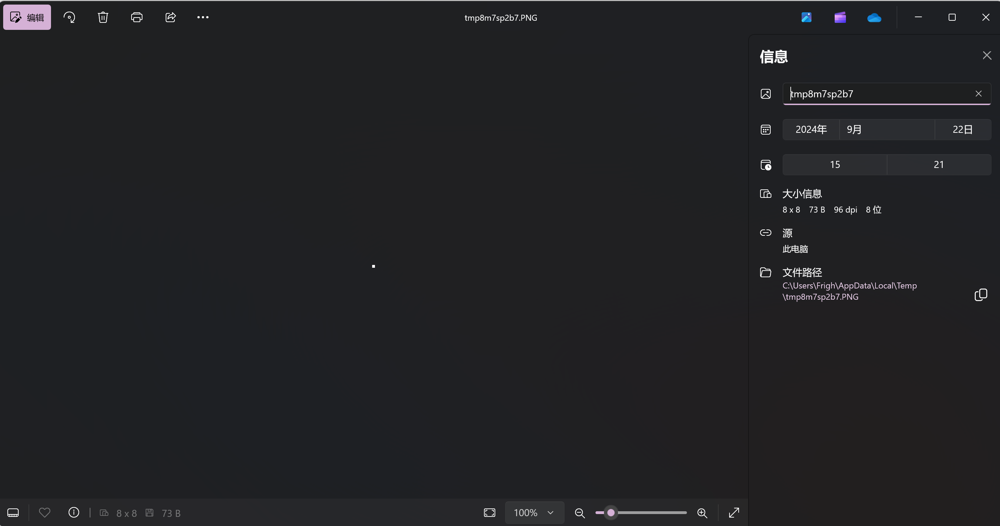
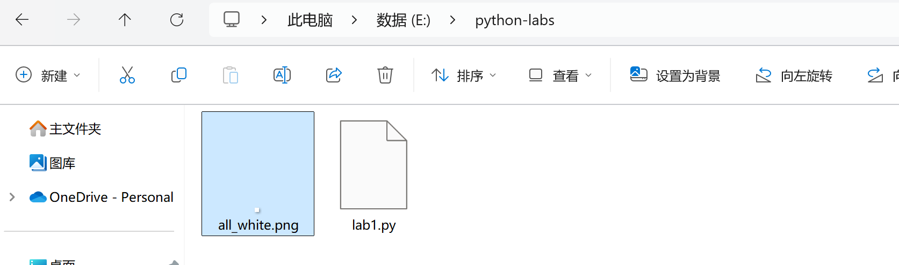

# 基于 NumPy 与 Pillow 的图像创建和基本变换

## 实验目的

1. 了解 Pillow 库在图像保存和显示中的作用。
2. 学习如何将 NumPy 数组转换为图像文件，并观察结果。
3. 探索图像变换：通过修改图像的不同部分（如颜色、形状等）来观察图像的变化。

## 实验环境

- Python 3.x 环境
- Pillow（PIL）库
- NumPy 库

## 实验步骤

### 库安装和引入

如果你尚未安装 NumPy 和 Pillow，可以参照[环境配置指南](./00env.md)中的指导进行安装. 在自行编写的 Python 脚本顶部输入

```python
import numpy as np
from PIL import Image
```

以在本实验中使用这两个库.

!!! note "关于 `#!python import` 指令"

    一般地，我们使用 `#!python import` 指令引入一个库. 直接使用

    ```python
    import os
    ```

    的指令时，使用其中的函数要使用成员操作符 `.`，例如 `os.system()` 就能执行 `os` 模块中的 `system` 函数. 在本实验中，我们用到了两种特殊的语法：其一是 `#!python import numpy as np`，它可以用来简化模块名，例如下面我们会使用 `np.ones()` 而非 `numpy.ones()`；另一是 `#!python from PIL import Image`，它使得我们可以不带前缀地引用某个对象或是子模块，例如我们要如此使用 Pillow 库的 `Image` 子模块而不能通过 `PIL.Image` 的方式使用. 也可以使用`#!python from numpy import ones` 以直接使用 `ones()`. 有兴趣的读者可以尝试各种引入方式，其结果应当是一致的——比如说你也可以把 `numpy` 缩写成 `npy`.

    但是，在有的地方你可能会看到 `#!python from ... import *` 的语法. 这种形式相当于将某个包中的所有变量都引入. 这在通常情况下是不建议的操作，尤其是对于第三方库，因为它会污染命名空间，有可能对我们的程序的可读性和调试的过程有负面影响.

### 图片的创建、打开和保存

接下来，我们使用 `np.ones()` 函数创建一个数组. 可以直接使用

```python
arr = np.ones((8, 8), dtype=np.uint8) * 255
```

创建一个整数类型，值全为 `255`，形状为 8*8 的二维数组.

!!! note "NumPy 中的数据类型"

    粗略地，可以将 NumPy 中的数据类型视作一个数组. 它有一个形状 `shape` 表示它的维数，是一个元组；有一个类型 `dtype` 标识其中元素的类型. 可以通过 `img.shape` 和 `img.dtype` 输出这两个参数.

    我们使用 `np.ones()` 函数创建了一个元素全为 1 的二维数组，其形状就是传入的参数 `(8, 8)`，类型设置为  `np.uint8` 表示类型为 8 位无符号整数. 回忆一下，它能表示的最大范围是多少？

    接下来，我们使用 `*` 运算符对其中的每个参数都乘了 `255`，也就是二进制的 `11111111`. 读者可输出这个数组的值进行观察.

可以通过 Pillow 库将数组转化为图像，并打开：

```python
img = Image.fromarray(arr)
img.show()
```

你会发现，弹出了一个图片浏览器窗口，并且其中出现了一个很小的白框框. 查看文件属性发现，它确实是一个 8*8 大小的图片：



再执行：

```python
img.save('all_white.png')
```

你会发现在**代码的同级目录**下出现了一个图片文件，如下图：



!!! note "关于保存路径和文件名"

    首先，最重要的事情，请保存你的代码文件！请保存你的代码文件！请保存你的代码文件！

    注意，一般情况下，代码文件应该放在你具备完全读写文件的文件夹下，否则有可能导致 `#!python OSError` 的报错. 如果出现类似的报错，请注意你的文件路径是否具备足够的权限.

    在这里，我们以相对路径的方式进行文件写操作. 实际上，你也可以以绝对路径（即盘符开头的路径）进行写操作. 相对路径与绝对路径的区别在于，它是从代码被执行的当前路径出发去寻找合适的保存位置的. 这使得它往往更加简短，也更加灵活.

### 图片的修改

NumPy 的数组支持对单个元素进行修改，其取元素的方法就是 `[]` 运算符. 因为这是一个二维数组，所以执行

```python
arr[2][2] = 128
```

可以将 `(2, 2)` 的位置改成 128. 注意，数组的下标是**从 0 开始的**，所以可行的下标只有 0 ~ 7（或负数 -8 ~ -1，与数组类似地），越界的下标将会出现如下报错：

```
Traceback (most recent call last):
  File "E:\python-labs\lab1.py", line 5, in <module>
    arr[8][0] = 128
IndexError: index 8 is out of bounds for axis 0 with size 8
```

报错的含义是直接的. 接下来，请读者自行修改 `arr` 的值来改变图像的内容，绘出更为丰富的图形. 你可以将数组的值修改为 0 ~ 255 之间的任意整数，以观察其颜色的变化.

!!! note "关于放大"

    在图像编辑器中观看图像时，我们会发现图像变得有些模糊. 这是因为图像编辑器对图像做了插值操作. 这不会影响图像的真实样貌，可以放心.

到目前为止，我们的代码应当如下所示：

```python
import numpy as np
from PIL import Image

arr = np.ones((8, 8), dtype=np.uint8) * 255
# 你需要修改的部分是从这里开始

# 到这里为止
img = Image.fromarray(arr)
img.save("pic1.png") # 记得保存图片时修改文件名
img.show()
```

现在，带着这段代码开始随意玩耍吧. 不要害怕报错，每一个报错都是学习的机会. 你可以尝试绘制更大的图形，甚至尝试画出彩色图像. 当然，这些也都可以写入你的实验心得当中一并提交.

## 提交方式

我们希望你提交以下内容：

1. 实验代码，`py` 类型的文件，可以有多个.
2. 实验结果，即运行之后的图像，`png` 或者 `jpg` 类型等等常见的图片类型均可.
3. 实验报告，包含对自己的代码的解释、结果分析，以及**过程中遇上的报错和任何遇到的好玩的问题**，以 `pdf` 类型文件提交.

一般地，只需要提交一个 `zip` 文件即可. 你也可以尝试：

1. 修改代码中保存文件的路径，进而整理文件结构，代码、运行结果和文档分开.
2. 使用 Jupyter Notebook，提交整合的 `ipynb` 类型文件.
3. 你也可以将你的尝试写成博客，发布到网上，然后提交可公开访问的链接.

作为一门编程语言类的课程，我们鼓励同学进行多种多样的尝试，因此，基于原始代码和功能之上的任何改动都是允许且被鼓励的. 但是，为了避免无意义的内卷，只需要完成基础功能、认真写完报告就能获得最高的分数，因此也不必勉强自己，尽情享受完成代码、修改代码的过程吧！

## 参考资料

- [NumPy 2.1 版本的官方文档](https://numpy.org/doc/2.1/)
- [Pillow 的官方文档](https://pillow.readthedocs.io/en/stable/)
