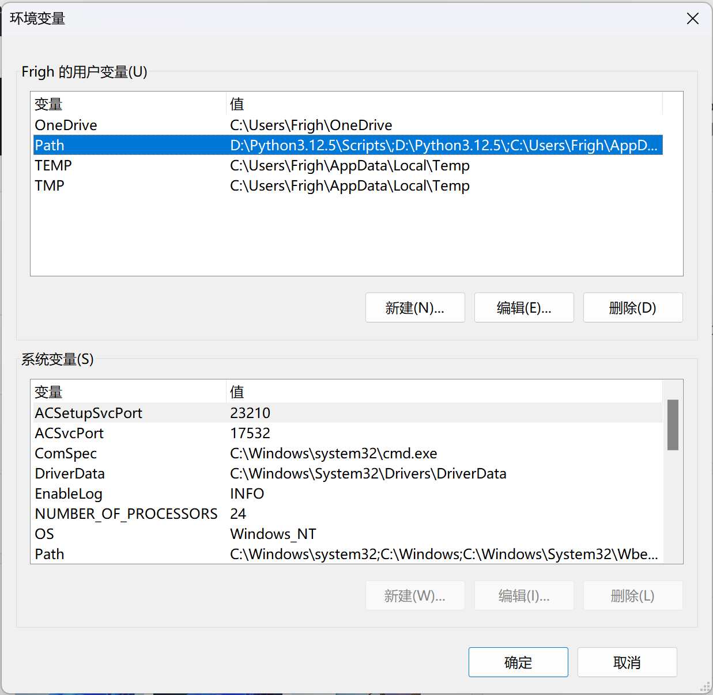
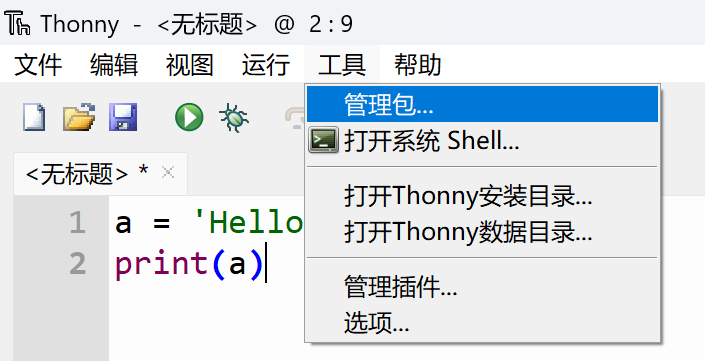
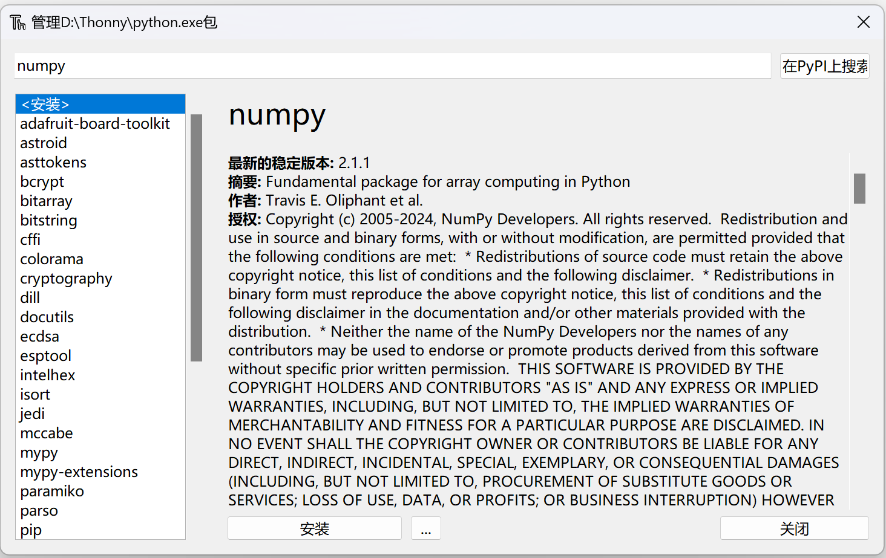

# 环境配置指南

如序言所述，我们建议读者使用 Visual Studio Code 完成实验，因此其使用方式会放在最开始进行介绍. 与之对应的，我们也准备了命令行的使用方法的介绍. 我们也保留了关于 Thonny 的介绍，这是历来学生较为喜欢的方式，也最为简单.

## Visual Studio Code 的安装和使用

进入[官方网页](https://code.visualstudio.com/)下载并安装. 注意，Visual Studio Code（下简称 VSCode）是一个编辑器而非集成开发环境，所以读者依然需要按照下面的提示去官网安装 Python 并妥善配置. 

### 一些建议安装的插件

VSCode 一大核心功能就是插件（extensions）. 安装之后打开，会在左侧看到一个图标，如下图所示（图片来自正在写文档的助教工作区）：


点开，在 Search Extension 当中搜索插件名字，如下图：


点击 Install 即可安装. 右上角标出的就是下载量，我们推荐的插件下载量都较大，且均由 Microsoft 官方提供，请大家注意辨别. 下面是建议安装的插件配置：

- Chinese (Simplified) (简体中文) Language Pack for Visual Studio Code
- Python
- Pylance

### 补充设置

按 ++control+comma++ 可以打开首选项界面，我们建议打开下面的选项：


它将高亮代码文件中易混淆的字符，例如中英文括号、逗号、冒号等等. 这些是初学者经常出现的错误. 当然，我们还是建议读者养成良好的输入习惯，防止出现问题.

### 一些基本概念

在 VSCode 中，代码是以文件夹的形式进行管理的. 点击文件菜单，打开文件夹（或者使用快捷键 ++control+k++ ++control+o++，意思是依次按下这两个组合）. 可以新建一个空文件夹以开始. 不建议将文件夹放在系统目录（例如桌面）以及使用路径中带有中文的文件夹.

打开文件夹之后，在左侧边栏的第一个按钮点开可以看到一个空页面，可以在此对文件夹中的文件进行管理. 在页面下面有一个终端（如果没有可以用快捷键 ++control+grave++ 呼出），其中会有以当前工作目录开头的一个提示. 下面称“使用终端执行”时，也都可以使用这个终端来完成. 需要注意，在修改环境变量（包括安装 Python）之后，需要重启 VSCode 以使更改生效.

使用 VSCode 执行 Python 代码的方式非常简单，在安装推荐插件并按照推荐配置安装 Python 后只要点击右上角即可. 

## Python 的安装和命令行使用

!!! warning

    这里的许多配置都并非最佳选项. 在本机上直接安装 Python 及其软件包更为推荐的一种方式是建立虚拟环境，使用例如 conda 之类的工具进行管理，否则可能会出现尾大不掉、甚至版本冲突的问题. 但是在此为了简单起见，我们直接使用本机的基础环境建立 Python 安装，这对于我们的这些实验本身来说足够了. 有兴趣的同学自可查找关于 conda 的相关信息，我们以后也可能会在补充文档中进行介绍.

    这里我们仅对 Windows 系统用户进行介绍. 如果使用 macOS，请读者跳到[命令行的使用部分](#_3)，用终端执行对应的指令完成操作. 至于 Linux 系统用户，你都用 Linux 了还需要文档吗？

### Python 的下载和安装

打开 [Python 官网](https://www.python.org/)，点击图示按钮下载 Python 的安装包：


运行安装包进行安装. 在安装过程中，勾选选项 "add to environment variable". 如果没有勾选，会出现在 Powershell 中无法识别指令的问题，请参见“环境变量相关事宜”一节进行解决.

### 命令行的使用

=== "Windows"

    按 ++win+r++ 打开运行界面，输入 powershell 并回车. 你应当会看到一片蓝色的界面：

    

    其中 `Frigh` 应该是你的用户名. 在其中输入 `python`，并回车. 为美观起见，下面笔者的界面都是安装了 Windows Terminal 之后的执行结果，默认终端输入输出无殊.

    

    你会发现我们同样进入了交互式终端的界面. 在其中你同样可以进行交互式终端的操作. 输入 `exit()` 或者 ++ctrl+z++ 以退出.

=== "macOS"

    在启动台中搜索“终端”，打开终端. 也可以使用快捷键 ++command+space++，然后输入“终端”进行搜索.

    

    在终端中输入 `python3` 并回车. 若之前没有使用过命令行工具，会提示安装 Xcode Command Line Tools，按照提示进行安装即可.

    

    安装完成后，即可通过在终端中输入 `python3` 并回车进入 Python 交互式终端. 输入 `exit()` 或者 ++control+d++ 以退出. **在后文中提到在命令行中输入 `python` 时，macOS 用户应当使用 `python3` 代替.**

    

### 使用 pip 进行包管理

在终端中输入下面的指令并按下回车：

```powershell
python -m pip install <包名>
```

其中 `<包名>` 需要替换成你需要安装的包. 我们以 NumPy 为例：


于是 NumPy 就已经安装成功. 同样可以打开交互式终端以验证其安装.

!!! note

    这里我们使用的是

    ```powershell
    python -m pip install <包名>
    ```

    而不是一般的教程使用的更精简的

    ```powershell
    pip install <包名>
    ```

    这是因为直接使用 `pip` 指令进行安装的方式在较新的版本中将被弃置.

    此外，如果 `python` 指令不起作用，可以尝试直接使用 `py` 或者 `python3`，如果依旧不行，请参阅环境变量相关事宜一节.

### 环境变量相关事宜

!!! note "提示"

    本节仅供 Windows 用户参考.

通俗地讲，环境变量（environment variable / PATH）就是系统在收到一个指令之后应该到哪里去寻找这个指令. 打开 Python 的安装目录，我们会看到一堆 exe 类型的文件：


复制这个路径以备使用. 在设置中搜索“环境变量”，打开“修改本账户的环境变量”，你会看到以下窗口：



然后选择 Path 变量，点击编辑，将这个目录和 `Scripts` 目录都加在最前面. 因为笔者使用的安装目录为 `D:\Python3.12.5`，修改完的 Path 就如上图所示. 修改完后，重启电脑，重新进行操作，你应当能够正常在命令行中执行 `python` 指令.

## Thonny 的安装和使用

### 下载并安装 Thonny

=== "Windows"

    打开 [Thonny 官网](https://thonny.org)，将鼠标移动到下图右上角的 "Windows" 上，选择第一个链接进行下载. 不建议使用 Python 3.8 的版本，事实上 Python 3.10 也并非最新，但对于本课程来说已经足够使用了.

    

    然后运行安装程序，按照指引完成安装. 等到出现如下界面，就表明安装已经完成：

    

=== "macOS"

    打开 [Thonny 官网](https://thonny.org)，将鼠标移动到下图右上角的 "macOS" 上，点击链接下载.

    

    打开下载的 `pkg` 文件，按照指引完成安装.

    

    安装完成后，你可以在启动台中找到 Thonny 的图标.

### Thonny 界面介绍和使用

点击 Thonny，选择简体中文，打开后其界面应当如下图所示：


可以看见，其界面的编辑区域分上下两块，其中上面是正常的编辑器，下面是交互式终端. 首先，可以在交互式终端输入命令进行测试：


可以看见，输出的两个 3 是有所不同的，这是因为 `print` 函数是正常的输出函数，而直接输入 `a` 输出 3 是在交互式终端中的特别结果. 应当注意，在正常的程序编写当中，只有 `print` 这样的函数会真正产生输出. 接下来在编辑器中尝试输入以下代码：


在菜单栏的运行菜单中选择“运行”，如下图所示：


或者你也可以直接点击 F5 进行运行. 注意到，在上图高亮的行末有一个 F5，这是 Thonny 中对快捷键的提示. 你会发现，在交互式终端的窗口中，出现了下面的输出：


这就表明程序正常运行并输出了结果.

### 使用 Thonny 进行包管理

点击菜单栏中的工具并选择“管理包…”，如下图：



这将打开下图的窗口：


在上面的搜索栏中输入包名，并且点击搜索，打开对应的蓝色链接，这里以 NumPy 为例，你将看到下面的界面：



点击安装并等待安装完成. 安装完成后，安装按钮会变成“升级”和“卸载”，关闭窗口. 可以在交互式终端中使用 `import` 命令导入包以测试其安装是否完成：

```python
>>> import numpy
```

如果没有红色报错信息，则说明安装正常.

## 使用 Ollama 在本地使用 Deepseek-R1（选做）

作为一个补充练习，以熟练文档阅读和命令行的使用，请阅读 [Ollama 官网上的文档](https://github.com/ollama/ollama/blob/main/README.md#quickstart)并且使用其运行 deepseek-r1:1.5b 或 deepseek-r1（后者需要至少 5GB 磁盘空间，前者只需要约 1.5GB）.

## 提交内容

提交一个 txt 文档，其中包含自己的系统信息、硬件配置以及所使用的 Python 版本信息，这个信息将在后续实验中用来安排实验任务，尽可能保证能在最糟糕的系统状态下执行. 可以选择提交一个 pdf 文档，其中包含自己的实验过程、心得以及与 AI 的互动等等信息以及选做内容.

### 对抗人工智能（选做）

下面的实验是一个人类和人工智能对抗的尝试. 请通过各种你能想到的可逆加密方式加密你提交的 txt 文档，保证：

1. deepseek-r1:1.5b 不能从密文恢复出明文；
2. 通过一定的步骤（在 pdf 中给出）人类能够恢复出明文；
3. 不涉及自定义密码本等额外信息（例如新华字典的页数-第几个字这样的信息就是不被允许的，因为它对人工智能来说是未知的）.

我们将会根据加密方式的简洁性和创造性给予一定的加分支持.

## 参考资料

- [Visual Studio Code 官网](https://code.visualstudio.com/)
- [Thonny 官网](https://thonny.org)
- [Python 官网](https://www.python.org)
- [pip 官方文档](https://pip.pypa.io/en/stable/user_guide/)
- [Ollama 官网](https://ollama.com/download)
